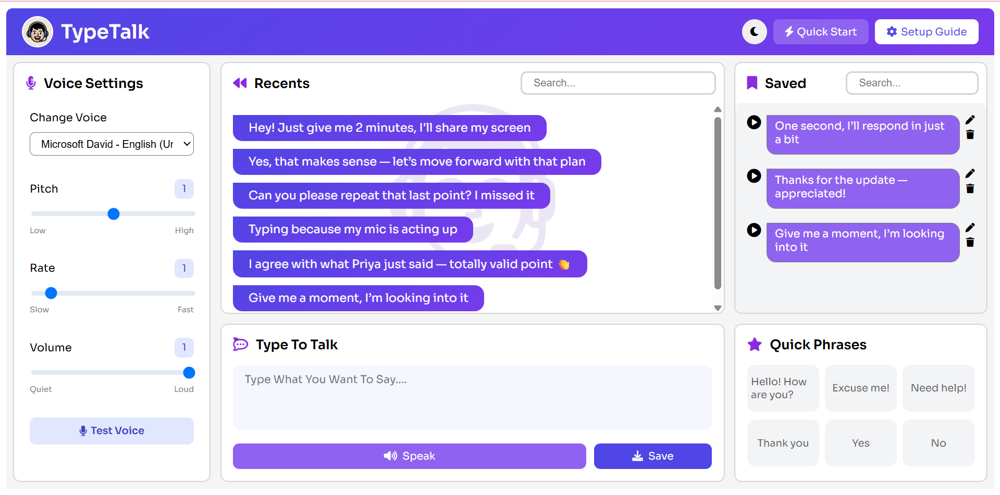
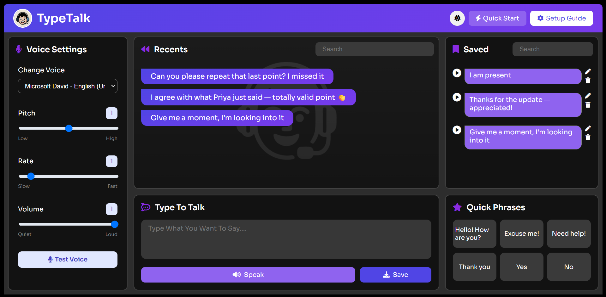

 

# TypeTalk 

TypeTalk is a little something I made *while still learning web development* using just **HTML, CSS, and JavaScript**.  
It's simple, it’s honest, and it was built to scratch a personal itch.

I’m an introverted programmer—and talking in random voice channels on Discord or in meetings can be awkward (and, let’s be real, mildly terrifying). So I made this: a way to “talk” without actually... talking. Just type, hit enter, and your message will be spoken out loud into any online call.

But I quickly realized it can help others too 👇

---

## 🌍 Real-World Use Cases

- **No mic? No problem.** Type what you want to say and it’ll be spoken straight into your Discord or Google Meet call.
- **Need silence around you?** If you're in a noisy café, a train, or a shared space—this sends only your typed message. No background noise.
- **Speech difficulties?** If talking out loud is hard or not an option, TypeTalk gives you a way to speak clearly with your keyboard.
- **Camera-shy? Mic-shy?** Me too. You can still participate in team meetings and say what you mean—without saying it.
- **Running on low bandwidth?** Skip the mic stream and just type it out—no mic needed, and no audio lag.

---

## ✨ Features

- **Type and Talk**: Press `Enter` after typing and boom—your message is spoken into the online call.  
  No mic noise. Just pure clean words.

- **Recent Messages**: See everything you recently said.  
  Forgot a brilliant point you made in the last meeting? It’s there.

- **Saved Phrases**: Save important lines for later for quick access.

- **Quick Phrases**: Need to say “Yes,” “No,” “Thanks,” or “Hello” quickly?  
  Buttons are ready. (And in future versions, you’ll be able to customize them too.)

---

## 📸 Screenshots

## LIGHT MODE

## DARK MODE

---

## 🚀 What the Future Looks Like

In the future, the goal is to turn this into a **fully functional online calling platform**—where typing your thoughts is just as natural (and powerful) as speaking them.

- **In-app voice-enabled calls**  
  Join or create calls directly in TypeTalk. Type → Speak → Communicate.  
  Mic and camera will still be there, but keyboard-powered voice will be the highlight.

- **Instant voice translation**  
  Others in your call might be speaking languages you don’t understand. No problem.  
  You’ll be able to select your preferred language (like English) and TypeTalk will translate incoming speech into that language *in real-time*.

- **Type in one language, speak in another**  
  You type in English, and your message gets spoken aloud in Spanish, Hindi, Japanese—whatever language your listener understands.  
  Smooth, clear, barrier-free conversation.

- **Tailored for every kind of use**  
  Whether you're in a noisy café, don’t have a mic, struggle with speech, or just love quiet meetings—this won’t just work for you, it’ll be *made* for you.

## ⚠️ Note from the Developer

I made this while I was still learning—and I’m still learning!  
If you find any bugs, I’m really sorry. Please feel free to report them or just drop me a friendly message:

📩 **absrshanks@gmail.com**

Thanks for checking out TypeTalk. I hope it makes speaking up just a little bit easier.  
– Abhisar 💻🧠
